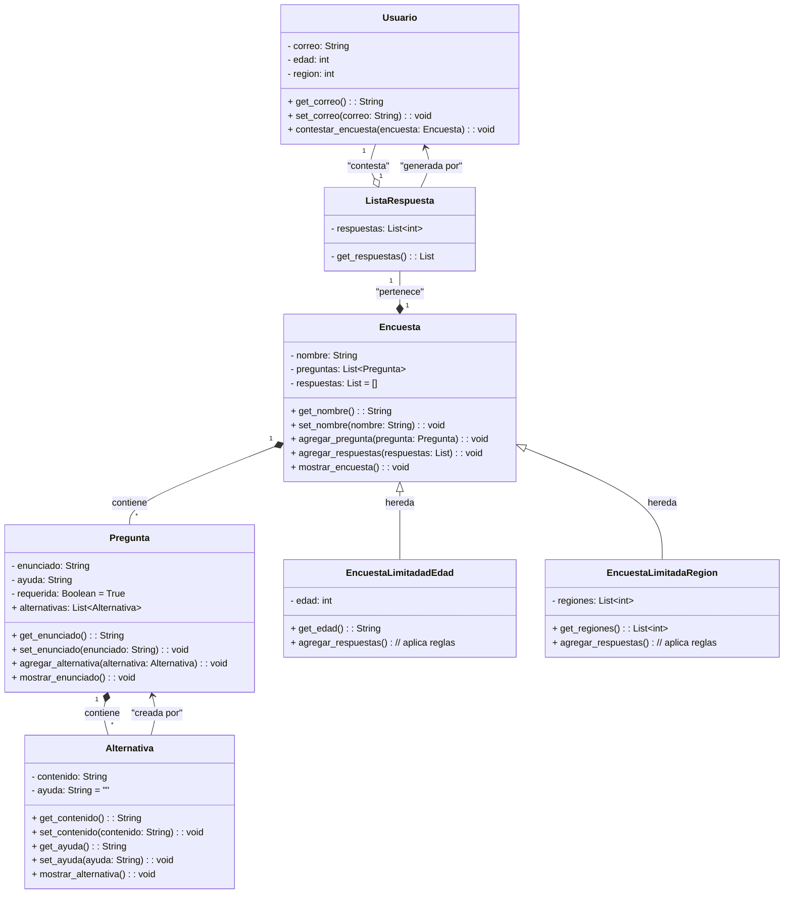

## Diagrama desarrollado

```mermaid
classDiagram
    %% Definición de las clases
    class Usuario {
        - correo: String
        - edad: int
        - region: int
        + get_correo(): String
        + set_correo(correo: String): void
        + contestar_encuesta(encuesta: Encuesta): void
    }
    class ListaRespuesta {
        - respuestas: List&lt;int&gt;
        - get_respuestas(): List
    }
    class Alternativa {
        - contenido: String
        - ayuda: String = ""
        + get_contenido(): String
        + set_contenido(contenido: String): void
        + get_ayuda(): String
        + set_ayuda(ayuda: String): void
        + mostrar_alternativa(): void
    }

    class Pregunta {
        - enunciado: String
        - ayuda: String
        - requerida: Boolean = True
        + alternativas: List&lt;Alternativa&gt;
        + get_enunciado(): String
        + set_enunciado(enunciado: String): void
        + agregar_alternativa(alternativa: Alternativa): void
        + mostrar_enunciado(): void
    }

    class Encuesta {
        - nombre: String
        - preguntas: List&lt;Pregunta&gt;
        - respuestas: List = []
        + get_nombre(): String
        + set_nombre(nombre: String): void
        + agregar_pregunta(pregunta: Pregunta): void
        + agregar_respuestas(respuestas: List): void
        + mostrar_encuesta(): void
    }
    class EncuestaLimitadadEdad {
        - edad: int
        + get_edad(): String
        + agregar_respuestas() // aplica reglas
    }
    class EncuestaLimitadaRegion {
        - regiones: List&lt;int&gt;
        + get_regiones(): List&lt;int&gt;
        + agregar_respuestas() // aplica reglas
    }
    %% Relaciones
    Usuario "1" --o  "1" ListaRespuesta: "contesta"
    ListaRespuesta --> Usuario : "generada por"
    ListaRespuesta "1" --* "1" Encuesta: "pertenece"
    Pregunta "1" *-- "*" Alternativa : contiene
    Alternativa --> Pregunta : "creada por"
    Encuesta "1" *-- "*" Pregunta : contiene
    Encuesta <|-- EncuestaLimitadadEdad : hereda
    Encuesta <|-- EncuestaLimitadaRegion : hereda
```
